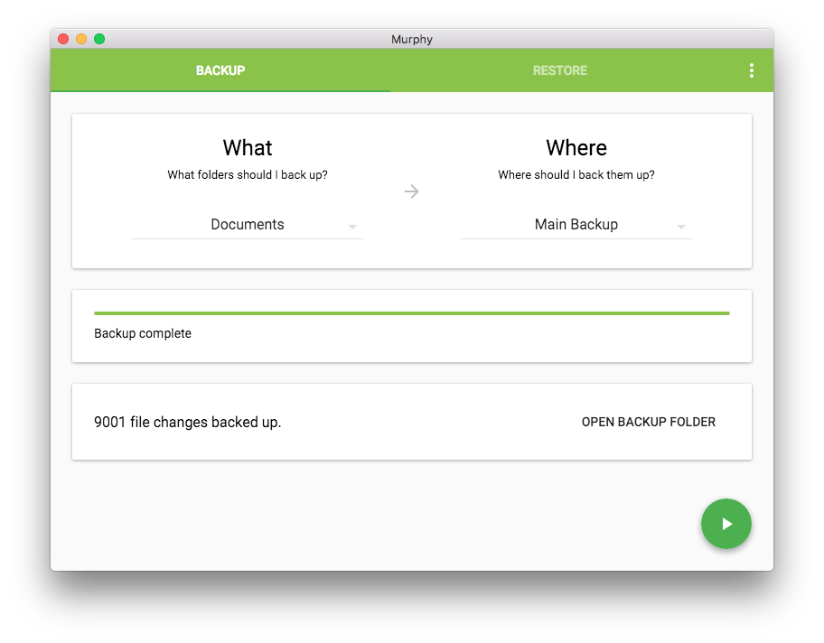

# Murphy

[](https://travis-ci.org/bmats/murphy) [](https://david-dm.org/bmats/murphy)


Murphy is a backup program which aims to make backing up and restoring files as painless as possible.
It was built using web technologies and [Electron][electron].

### Features

- Incremental backup (files are copied only if they have changed)
- Backup versions are stored in a human-friendly format
- A "Latest" folder in each backup is kept up-to-date with symlinks to the latest version of each file, showing you what is in the backup and allowing restores without using Murphy
- Any set of folders can be backed up together
- Paths to be ignored can be specified using regexes
- Cross platform



## Building

```sh
npm install
gulp build # just build
gulp # build and run (^C to quit)

gulp package # build standalone app
```

### Built with

- [Electron][electron]
- [TypeScript][typescript]
- [React][react]
- [Material UI][mui]

[electron]: http://electron.atom.io/
[typescript]: http://www.typescriptlang.org/
[react]: https://facebook.github.io/react/
[mui]: http://www.material-ui.com/

### License

[MIT](LICENSE)
